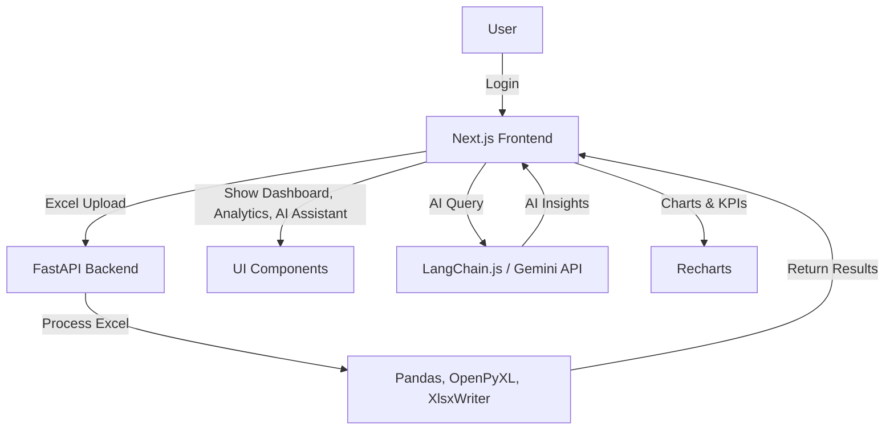
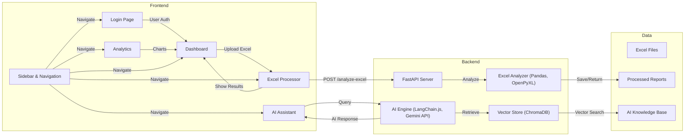
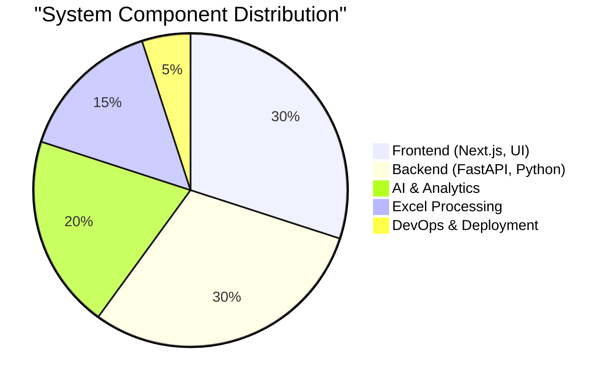
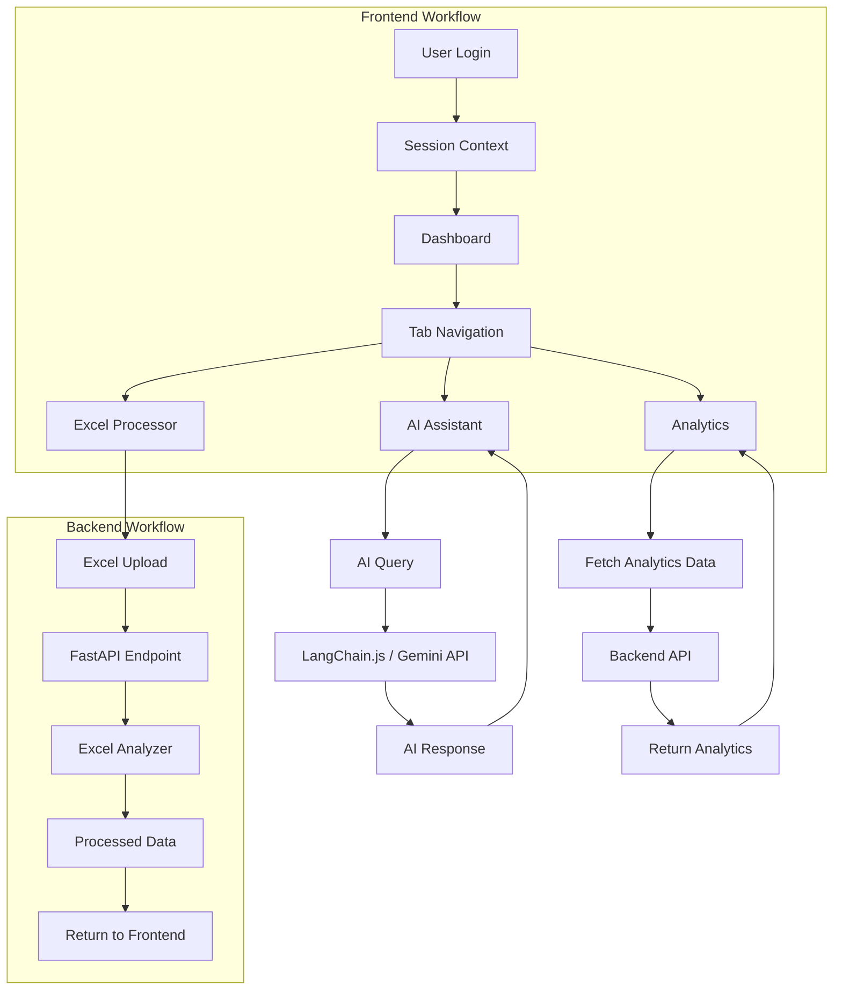
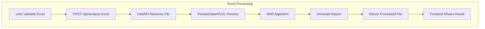
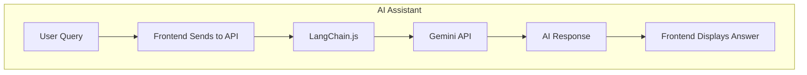
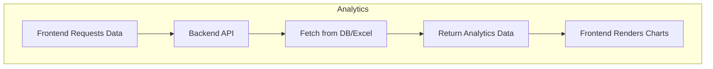
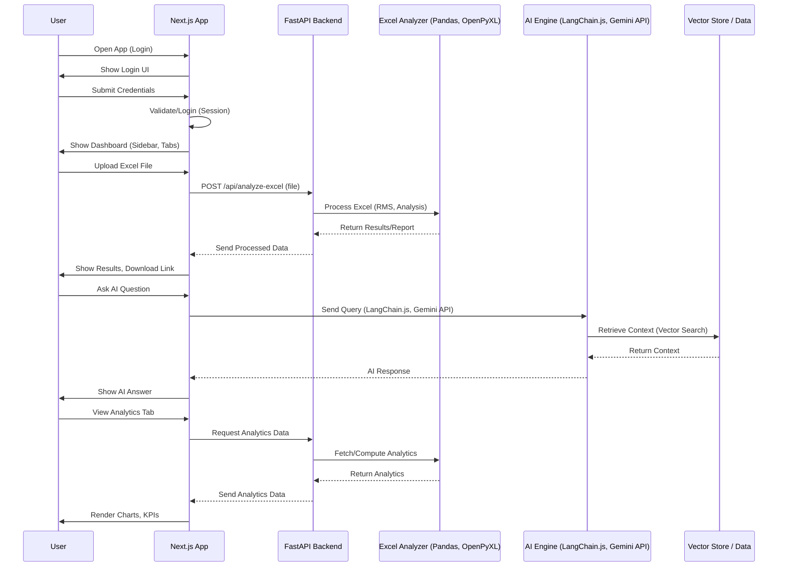
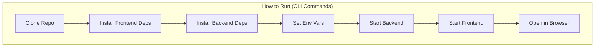

# i-WMS – Intelligent Warehouse Management System

A modern, AI-powered warehouse management platform with real-time analytics, Excel automation, and a beautiful, responsive UI.

---

## 🚀 At a Glance

- **Next.js 14** (App Router, TypeScript, Tailwind CSS)
- **FastAPI** backend for Excel analytics
- **AI Assistant** (LangChain.js, Gemini API)
- **Interactive Dashboards** (Recharts)
- **Elegant, glassmorphic UI**

---

## 🏗️ System Architecture



---

## 🖥️ Component Overview



---

## 📊 System Component Distribution



---

## 🔄 Workflow Overview



---

## 📥 Excel Processing Pipeline



---

## 🤖 AI Assistant Query Flow



---

## 📈 Analytics Data Flow



---

## 🧩 Full System Process (Sequence Diagram)



---

## ⚡ Quickstart (CLI)



### 1. Clone & Install
```bash
# Clone repository
$ git clone <repository-url>
$ cd i-wms

# Install frontend dependencies
$ npm install

# Install backend dependencies
$ cd reference
$ pip install -r requirements.txt
```

### 2. Configure Environment
```bash
# Copy and edit environment variables
$ cp .env.example .env.local
# Edit .env.local with your API keys and backend URL
```

### 3. Run Backend
```bash
$ cd reference
$ python api_process.py
```

### 4. Run Frontend
```bash
$ cd ..
$ npm run dev
```

### 5. Open in Browser
Go to: [http://localhost:3000](http://localhost:3000)

---

## ✨ Features

- **Login & Auth**: Secure, role-based access
- **Dashboard**: Real-time KPIs, charts, and system status
- **Excel Processor**: Drag & drop upload, RMS analysis, instant report download
- **AI Assistant**: Natural language queries, context-aware insights
- **Analytics**: Advanced charts, time filtering, exportable reports
- **Modern UI**: Sidebar, tab navigation, notifications, glassmorphism

---

## 🛠️ Tech Stack

- **Frontend**: Next.js 14, TypeScript, Tailwind CSS, Framer Motion, Recharts
- **Backend**: FastAPI, Python, Pandas, OpenPyXL, XlsxWriter
- **AI**: LangChain.js, Gemini API, ChromaDB (optional)
- **DevOps**: Vercel, Docker, Railway, Fly.io

---

## 🧭 Project Structure

- `app/` – Next.js App Router (pages, layout, API)
- `components/` – UI components (Sidebar, Dashboard, etc.)
- `backend/` & `reference/` – FastAPI backend, Excel logic
- `public/` – Static assets (logo, favicon)
- `lib/` – Utility libraries (AI, Excel, vectorization)

---

## 📝 License

MIT License. See [LICENSE](LICENSE).

---

**@Robotjaol @Kambingturbo** 